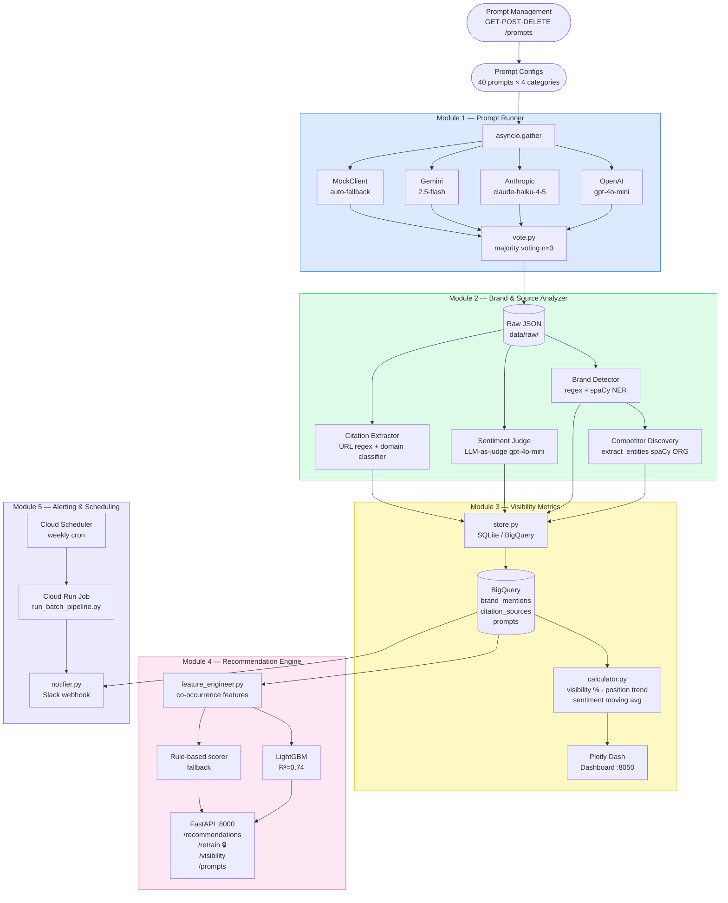
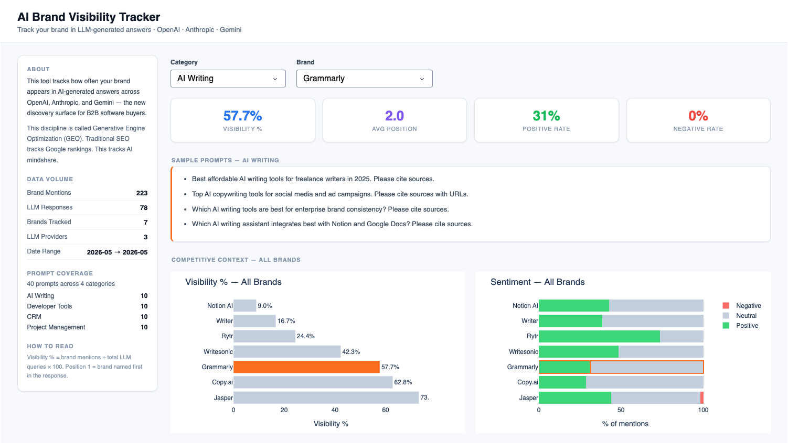
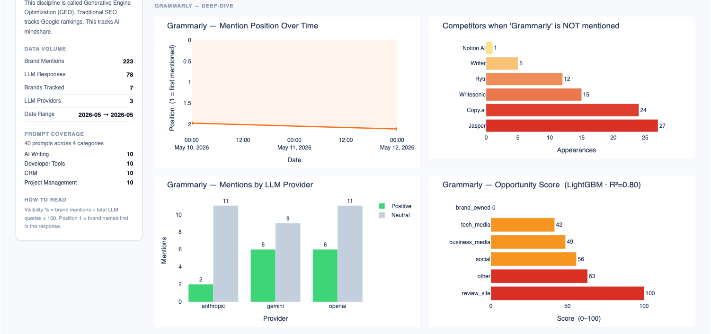
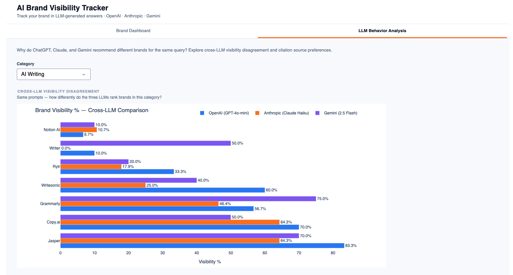
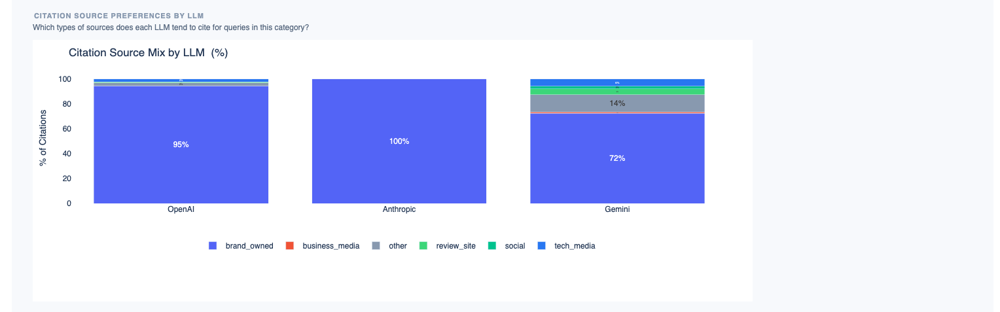

# AI Brand Visibility Tracker

> **Track your brand in AI-generated answers — before your competitors do.**

A production-grade Python system that monitors how often a brand appears in LLM responses across OpenAI, Anthropic, and Gemini, analyzes sentiment and citation sources, trains a LightGBM recommendation model, and delivers automated Slack alerts when visibility drops — all backed by Google BigQuery and scheduled via Cloud Run.

Inspired by tools like [Peec AI](https://peec.ai) — built with real APIs and production infrastructure instead of UI scraping, for portfolio and educational purposes.

**`3 LLMs`** · **`40 prompts`** · **`27 brands`** · **`1,209 mentions`** · **`85 tests`** · **`CI/CD`** · **`Cloud Run + Scheduler`**

---

## Why This Exists

ChatGPT, Perplexity, and Gemini are becoming the primary discovery surface for B2B software. When a buyer asks *"What's the best CRM for a Series A startup?"*, the AI's answer directly shapes the shortlist — often without the buyer ever clicking a search result.

Traditional SEO tools track Google rankings. They are blind to whether your brand is being recommended by AI assistants. This emerging discipline is called **Generative Engine Optimization (GEO)** or **Answer Engine Optimization (AEO)**.

### What this system answers

| Business Question | How the System Answers It |
|---|---|
| Is my brand being mentioned at all? | Visibility % across 3 LLMs, 40 prompts, per category |
| How do I rank vs competitors? | Competitor gap: who appears in prompts where you don't |
| Is AI portraying my brand positively? | LLM-as-judge sentiment (positive / neutral / negative) |
| Which content investments will move the needle? | LightGBM opportunity score per domain type |
| Which citations drive competitor mentions? | Citation co-occurrence breakdown by domain type |
| Will I know when visibility drops? | Slack alert fires automatically after each scheduled run |

### Who this is for

- **B2B SaaS marketing teams** — benchmark brand presence in AI-generated buyer journeys
- **PR and content teams** — identify which review sites, tech media, and communities to target
- **Competitive intelligence** — detect when competitors gain or lose AI mindshare

---

## Architecture



### Module 1 — Prompt Runner
Queries multiple LLM APIs concurrently using `asyncio.gather`. Supports OpenAI, Anthropic, and Gemini. Automatically falls back to a `MockClient` when an API key is missing or invalid — no code changes required.

Includes **majority voting** (`vote.py`): run each prompt N times and keep only brands that appear in more than half the trials, eliminating false positives caused by LLM non-determinism.

Prompts are managed dynamically — stored in SQLite/BigQuery and editable via the REST API (`POST /prompts`). The 40 built-in prompts seed the database automatically on first run.

### Module 2 — Brand & Source Analyzer
Parses LLM responses to extract:
- **Brand mentions** — which brands appear, in what position order
- **Sentiment** — LLM-as-judge via `gpt-4o-mini` (batched async calls, positive/neutral/negative)
- **Citation sources** — URLs extracted via regex, classified into 10 domain types (review_site, tech_media, community, developer, etc.)
- **Competitor discovery** — spaCy NER (`extract_entities`) finds ORG entities not in the target brand list, surfacing unknown competitors organically

### Module 3 — Visibility Metrics & Dashboard
Persists results to BigQuery (production) or SQLite (local dev) with a unified storage interface. Computes time-series metrics: visibility %, position trend, sentiment moving average, competitor gap.

**Tab 1 — Brand Dashboard:**
- Category → Brand cascade dropdown — all metrics scoped to the selected product category
- 4 KPI cards: Visibility %, Avg Position, Positive Rate, Negative Rate
- Sample prompts panel — shows the actual questions sent to LLMs for the selected category
- Left sidebar — live data volume stats updated per category
- 6 reactive charts: Visibility % ranking, Sentiment breakdown, Position over time, Competitor gap (same-category brands only), Provider breakdown, LightGBM opportunity score





**Tab 2 — LLM Behavior Analysis:**
- Cross-LLM visibility disagreement — same prompts, how differently do OpenAI, Anthropic, and Gemini rank each brand?
- Citation source preferences by LLM — which types of sources (review sites, tech media, community, etc.) does each LLM tend to cite?





### Module 4 — Recommendation Engine
Trains a LightGBM model on citation co-occurrence features to predict which content channel (review site, tech media, community, etc.) will most improve visibility vs competitors. Served via FastAPI with hot-reload retraining — `POST /retrain` reloads the model in memory without server restart. Prompts can be added, listed, or deleted via the API without editing any Python files.

### Module 5 — Alerting & Scheduling
Automated weekly data collection and visibility monitoring:
- **Cloud Scheduler** triggers a **Cloud Run Job** on a weekly cron schedule
- The job runs `run_batch_pipeline.py --category <target>` against all 3 LLM APIs
- After saving, `notifier.py` queries the latest visibility figures and fires a **Slack webhook alert** if any brand falls below the configured threshold or drops more than a defined number of percentage points vs the previous run
- Fully configurable via `.env`: `VISIBILITY_ALERT_THRESHOLD`, `VISIBILITY_DROP_ALERT`, `SLACK_WEBHOOK_URL`

---

## Tech Stack

| Layer | Technologies |
|-------|-------------|
| LLM APIs | OpenAI API, Anthropic API, Google Gemini API |
| Concurrency | `asyncio`, `tenacity` (retry with backoff) |
| NLP | spaCy NER (`en_core_web_sm`), LLM-as-judge (gpt-4o-mini) |
| ML | LightGBM, scikit-learn |
| Storage | Google BigQuery, SQLite (auto-fallback) |
| Visualization | Plotly Dash |
| API | FastAPI, Uvicorn |
| Data | pandas, Pydantic v2 |
| Alerting | Slack Incoming Webhooks |
| Infra | Docker, Google Cloud Run, Google Cloud Scheduler |
| Testing | pytest, pytest-asyncio (85 tests) |
| CI | GitHub Actions |

---

## Project Structure

```
ai-brand-visibility-tracker/
├── src/
│   ├── prompt_runner/
│   │   ├── llm_clients.py        # OpenAI / Anthropic / Gemini / Mock clients
│   │   └── runner.py             # asyncio concurrent query engine (n_runs support)
│   ├── analyzer/
│   │   ├── brand_detector.py     # regex + spaCy NER brand matching + entity discovery
│   │   ├── sentiment_judge.py    # LLM-as-judge sentiment scoring
│   │   ├── citation_extractor.py # URL extraction + 10-type domain classification
│   │   ├── vote.py               # majority voting across N trials
│   │   └── pipeline.py           # orchestrates analyzer steps, returns discovered competitors
│   ├── metrics/
│   │   ├── calculator.py         # visibility %, position trend, competitor gap (category-scoped)
│   │   └── dashboard.py          # Plotly Dash interactive dashboard
│   ├── storage/
│   │   ├── store.py              # unified interface (auto-routes BigQuery vs SQLite)
│   │   ├── bigquery_store.py     # BigQuery backend
│   │   ├── sqlite_store.py       # SQLite backend
│   │   └── schema.py             # shared DDL / BQ schema (4 tables)
│   ├── recommender/
│   │   ├── feature_engineer.py   # builds feature matrix from stored data
│   │   ├── scorer.py             # rule-based opportunity scorer (fallback)
│   │   ├── train_lgbm.py         # LightGBM training + inference + model persistence
│   │   └── api.py                # FastAPI endpoints (recommendations, metrics, prompts)
│   ├── alerting/
│   │   └── notifier.py           # Slack webhook alert on visibility drop
│   └── utils/
│       ├── config.py             # env vars + paths
│       └── models.py             # Pydantic data models
├── tests/
│   ├── test_brand_detector.py     # 13 tests: regex, word boundary, position order
│   ├── test_citation_extractor.py # 16 tests: domain classification, URL parsing
│   ├── test_calculator.py         # 11 tests: visibility %, sentiment trend, competitor gap
│   ├── test_pipeline.py           # 16 tests: async pipeline with mocked LLM judge
│   ├── test_scorer.py             # 10 tests: opportunity score calculation
│   ├── test_retrain_auth.py       #  4 tests: API key auth on /retrain
│   └── test_vote.py               # 10 tests: majority voting logic
├── data/
│   ├── prompts_batch.py           # 40 built-in prompts (seeded to DB on first run)
│   └── raw/                       # raw LLM response JSONs (gitignored)
├── docs/                          # dashboard screenshots
├── demo_module1.py                # run LLM queries
├── demo_module2.py                # analyze latest run
├── demo_module3.py                # save to DB + launch dashboard
├── demo_module4.py                # launch FastAPI
├── demo_lgbm.py                   # train LightGBM + show results
├── run_batch_pipeline.py          # batch pipeline (prompts × LLMs → BigQuery → alert)
├── Dockerfile
├── pytest.ini
└── environment.yml
```

---

## Setup

### Prerequisites
- [Miniconda](https://docs.conda.io/en/latest/miniconda.html)
- API keys: OpenAI (required), Anthropic + Gemini (optional — auto-mock if missing)
- GCP project with BigQuery enabled (optional — auto-falls back to SQLite)

### 1. Create conda environment

```bash
conda env create -f environment.yml
conda activate brand-tracker
python -m spacy download en_core_web_sm
```

> **Apple Silicon (M1/M2/M3):** LightGBM requires the conda-forge build:
> ```bash
> pip uninstall lightgbm -y
> conda install -c conda-forge lightgbm -y
> ```

### 2. Configure environment variables

```bash
cp .env.example .env
```

Edit `.env`:

```env
# Required
OPENAI_API_KEY=sk-proj-...

# Optional — system uses MockClient if empty
ANTHROPIC_API_KEY=sk-ant-api03-...
GOOGLE_API_KEY=AIzaSy...

# Optional — system uses SQLite if not configured
GCP_PROJECT_ID=your-project-id
BIGQUERY_DATASET=brand_tracker
GOOGLE_APPLICATION_CREDENTIALS=/path/to/service-account.json

# Required to call POST /retrain
RETRAIN_API_KEY=your-secret-key

# Optional — Slack alerts when visibility drops
SLACK_WEBHOOK_URL=https://hooks.slack.com/services/...
VISIBILITY_ALERT_THRESHOLD=15.0
VISIBILITY_DROP_ALERT=5.0
```

### 3. (Optional) GCP / BigQuery setup

1. Enable BigQuery API in [GCP Console](https://console.cloud.google.com)
2. Create a Service Account with roles `BigQuery Data Editor` + `BigQuery Job User`
3. Download the JSON key → save to `~/.gcp/brand-tracker-sa.json`
4. Set `GOOGLE_APPLICATION_CREDENTIALS` in `.env`

---

## Usage

### Quick start — run all modules in order

```bash
# Step 1: Query LLMs
python demo_module1.py

# Step 2: Analyze brand mentions + citations
python demo_module2.py

# Step 3: Save to DB + open dashboard (http://localhost:8050)
python demo_module3.py

# Step 4: Launch recommendation API (http://localhost:8000/docs)
python demo_module4.py
```

### Batch data collection

```bash
# Dry run — preview prompts without API calls
python run_batch_pipeline.py --dry-run

# Run all prompts × 3 LLMs (~$0.08, ~5-10 min)
python run_batch_pipeline.py

# Run one category only (cheaper, ~$0.01)
python run_batch_pipeline.py --category crm

# Run with majority voting — 3 trials per prompt for stable brand detection
python run_batch_pipeline.py --n-runs 3 --category crm
```

### Train LightGBM model

```bash
python demo_lgbm.py
```

### Run tests

```bash
pytest -v
```

### API endpoints

Once `demo_module4.py` is running:

```bash
# Get recommendations (LightGBM if model exists, falls back to rule-based)
curl -X POST http://localhost:8000/recommendations \
  -H "Content-Type: application/json" \
  -d '{"target_brand": "Asana", "competitors": ["Jira", "Linear", "Monday.com"], "top_n": 5}'

# Visibility summary
curl "http://localhost:8000/visibility?brands=Asana,Jira,Monday.com"

# Competitor gap analysis
curl http://localhost:8000/competitor-gap/Asana

# Retrain model on latest data — requires API key
curl -X POST http://localhost:8000/retrain \
  -H "X-API-Key: your-secret-key"

# Prompt management
curl http://localhost:8000/prompts
curl -X POST http://localhost:8000/prompts \
  -H "Content-Type: application/json" \
  -d '{"prompt_text": "Best project management tool for remote teams?", "category": "project_management", "target_brands": ["Asana", "Notion", "Linear"]}'
curl -X DELETE http://localhost:8000/prompts/pm_b01
```

Interactive API docs: `http://localhost:8000/docs`

---

## Infrastructure — Cloud Run + Scheduler

The pipeline runs on a weekly schedule via Google Cloud:

```
Cloud Scheduler (cron: 0 9 * * 1, Asia/Taipei)
  → Cloud Run Job (brand-tracker-pipeline)
    → run_batch_pipeline.py --category <target>
      → LLM APIs → BigQuery
      → notifier.py → Slack alert (if visibility drops)
```

```bash
# Deploy Docker image (amd64)
docker build --platform linux/amd64 --provenance=false \
  -t us-central1-docker.pkg.dev/$PROJECT_ID/brand-tracker/pipeline:latest .
docker push us-central1-docker.pkg.dev/$PROJECT_ID/brand-tracker/pipeline:latest

# Create Cloud Run Job
gcloud run jobs create brand-tracker-pipeline \
  --image us-central1-docker.pkg.dev/$PROJECT_ID/brand-tracker/pipeline:latest \
  --region us-central1 \
  --args "run_batch_pipeline.py,--category,crm" \
  --set-secrets OPENAI_API_KEY=OPENAI_API_KEY:latest \
  --set-env-vars GCP_PROJECT_ID=$PROJECT_ID,BIGQUERY_DATASET=brand_tracker \
  --service-account brand-tracker-sa@$PROJECT_ID.iam.gserviceaccount.com

# Schedule weekly run
gcloud scheduler jobs create http brand-tracker-weekly \
  --schedule "0 9 * * 1" \
  --uri "https://us-central1-run.googleapis.com/apis/run.googleapis.com/v1/namespaces/$PROJECT_ID/jobs/brand-tracker-pipeline:run" \
  --oauth-service-account-email brand-tracker-sa@$PROJECT_ID.iam.gserviceaccount.com \
  --time-zone "Asia/Taipei" \
  --location us-central1
```

---

## Data Models

```python
LLMResponse      # run_id, provider, prompt, response_text, latency_ms
BrandMention     # brand, position, sentiment (positive/neutral/negative), snippet
CitationSource   # url, domain, domain_type (review_site / tech_media / community / ...)
PromptConfig     # prompt_id, prompt_text, category, target_brands
```

---

## ML Model

**Problem:** Given a (brand, domain_type) pair, predict opportunity score = how much investing in this content channel will improve brand visibility vs competitors.

**Features:**
- `cooccurrence` — how often brand appears in prompts citing this domain type
- `competitor_avg_cooccurrence` — competitor benchmark
- `avg_position_with_source` — brand position quality when cited alongside this source
- `total_mentions` — brand's overall visibility
- `domain_authority_weight` — domain type prior (review sites > social media)
- + 5 more derived features

**Target:** `competitor_avg_cooccurrence - brand_cooccurrence` (positive = gap = opportunity)

**Results (trained on 1,209 brand_mentions, 1,107 citations, 27 brands):**

| Metric | Value |
|--------|-------|
| R² | 0.74 |
| MAE | 3.33 |
| Top feature | `cooccurrence` |

---

## Docker

```bash
# Build
docker build -t brand-tracker .

# Train model locally first
python demo_lgbm.py

# Run API server
docker run -p 8000:8000 --env-file .env -v $(pwd)/data:/app/data brand-tracker
```

> On startup the API loads `data/lgbm_opportunity_model.pkl` from the mounted volume. If not found, it auto-trains from available BigQuery data. If neither is possible, it falls back to rule-based scoring.

---

## Data Coverage

Trained and validated across 4 SaaS categories (1,209 brand mentions · 1,107 citation sources · 27 brands):

| Category | Brands Tracked |
|----------|---------------|
| Project Management | Asana, Jira, Linear, Monday.com, Notion, ClickUp, Trello, Basecamp |
| CRM | HubSpot, Salesforce, Pipedrive, Attio, Zoho CRM, Close, Copper |
| AI Writing Tools | Jasper, Copy.ai, Grammarly, Writer, Writesonic, Notion AI, Rytr |
| Developer Tools | GitHub, GitLab, Linear, Jira, Azure DevOps, Shortcut, YouTrack |
